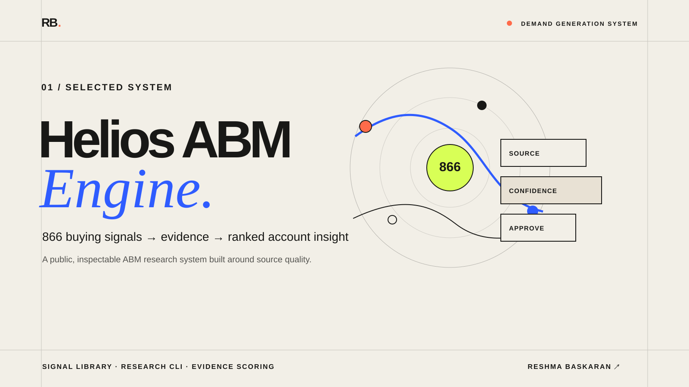

# ABM Engine: Turn Buying Signals Into Relevant Messages



ABM Engine is an evidence-first account research and messaging starter kit. It
turns a campaign brief into scoped research questions, source-backed buying
signals, a reviewable account score, and grounded message inputs.

The repository is designed to run locally from a fork. It is a research layer,
not a hosted enrichment or campaign platform.

## The problem

Most enrichment workflows produce rows of data. ABM teams still have to decide which facts matter, whether a source supports the claim, what the timing signal means, and how it should change the message.

ABM Engine encodes that judgment in an inspectable workflow:

1. Select relevant signals for the account and campaign.
2. Render targeted research queries.
3. Attach a source and concrete evidence.
4. Normalize confidence and apply signal weight.
5. Require human approval.
6. Rank approved evidence for the message brief.

## What is included

- A [quickstart](QUICKSTART.md), local configuration example, and workspace initializer.
- A default **21-signal industry-agnostic pack** extracted from recurring
  concepts in the original library, with applicability, disqualifiers, source
  priority, freshness, safe interpretation, and prohibited inference.
- The original **866 signal definitions** and **858 unique signal keys** across
  retail and financial-services markets, available as the `legacy` pack.
- A zero-dependency Python parser and CLI.
- Scoped keys for signal names reused across markets.
- Query-template rendering for every portable signal.
- A fail-closed account workflow that reports missing campaign inputs and does
  not create a message brief prematurely.
- Evidence validation and approval-gated scoring.
- Human-review message-brief generation from complete campaign inputs and
  approved evidence only.
- Blank research-record, evidence-record, and message-brief templates.
- Three real, first-party-sourced account research records.
- Tests that lock the verified library counts and scoring boundaries.

## What a fork gives you

After setup, a fork gives you a local research workspace, the signal library,
query rendering, evidence-record templates, and a reviewable path from signal
to message brief. Add your own account inputs and public sources; do not commit
private contact data, CRM records, credentials, or campaign state.

The signal library contains research hypotheses, not proof of buying intent. A
source-backed observation still needs a human review before it informs outbound.

## Quick start

See [QUICKSTART.md](QUICKSTART.md) for the full setup. The short version:

```bash
python3 -m venv .venv
source .venv/bin/activate
python -m pip install -e .

abm-engine stats
abm-engine search "AI initiative" --limit 5
abm-engine render public_product_launch --company-name "Attio" --company-domain attio.com

abm-engine account-run \
  --brief templates/campaign-brief.json \
  --company-name "Attio" \
  --company-domain attio.com \
  --industry "B2B SaaS CRM" \
  --out /path/outside/the/repository/attio
```

Run the tests:

```bash
python -m unittest discover -s tests -v
```

## Why this engine exists

ABM Engine is an opinionated research system for converting account signals
into source-backed message inputs. The signal taxonomy, evidence record,
confidence treatment, human approval boundary, and message-grounding workflow
are built into the model, making account-level research logic visible and
auditable.

## Real account cases

The [case records](cases/README.md) use Lowe's, Klarna, and Bank of America to show how public evidence is recorded and how confirmed observations are separated from interpretation. They do not claim a customer relationship or active opportunity.

## Architecture

See [docs/architecture.md](docs/architecture.md).

## Current status

The original signal library and research workflow were extracted from an
operating ABM platform and rebuilt as a standalone public engine. The portable
pack is a conservative cross-industry layer; it does not relabel sector logic
as universal intent. The legacy retail and financial-services definitions
remain inspectable through `--pack legacy`. Vendor integrations, contact
enrichment, and campaign execution are intentionally excluded.

## Author

Built by **Reshma Baskaran**, a GTM and growth marketer building practical research, outbound, and knowledge systems.
