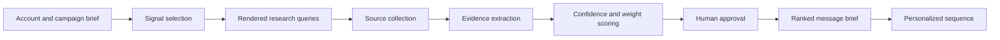

# Architecture

## Signal packs

- `industry-agnostic-signals.json` is the default portable pack. Every signal
  has applicability, disqualifiers, preferred sources, freshness, a safe
  interpretation, and a prohibited inference.
- `signal-library.md` is the original retail and financial-services library.
  It is available as `--pack legacy` and must not be scored against another
  industry without calibration.

The account workflow fails closed on missing seller, offer, buyer, objective,
desired action, or proof. Research hypotheses may be created before those
fields are complete; a message brief may not.

The engine treats a signal as a research hypothesis until a source URL and concrete evidence are attached. A high library weight does not turn an unsupported claim into evidence. Human approval remains the boundary between research and outbound use.

## Data model

- `Signal`: a scoped research definition containing a key, label, category, optional weight, optional confidence, and optional query template.
- `Evidence`: a source-backed observation attached to a signal.
- `scoped_key`: `industry::sub-industry::key`; this preserves intentionally repeated keys across different markets.

## Why the engine is inspectable

The library is plain Markdown. The parser and scorer use the Python standard library. Every score can be traced back to a signal definition, evidence string, source URL, weight, and confidence value.
